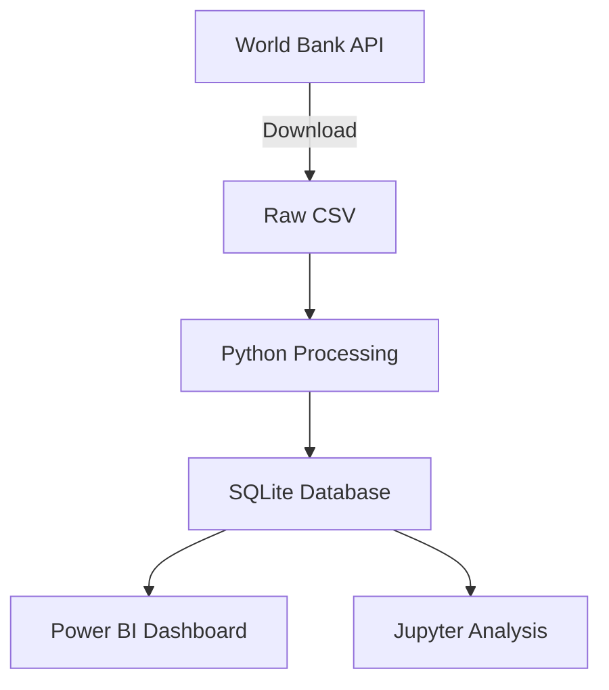

# World Bank Data Analysis Project


```markdown

This repository includes all necessary scripts, documentation, and resources to run the project end-to-end.
This project analyzes World Development Indicators from the World Bank. It includes:

1. Data ingestion and cleaning of World Bank datasets
2. SQLite database creation with optimized structure
3. Power BI dashboard for visualizing economic indicators
4. Data quality checks and validation scripts


## Features

- Automated data download and processing
- Advanced data cleaning for missing values and inconsistencies
- Star schema database design
- Interactive Power BI dashboard with:
  - World GDP map visualization
  - Time series analysis
  - Country comparison tools
  - Income group analysis
- Data validation scripts


```

## Getting Started

### Prerequisites

- Python 3.8+
- PowerShell (Windows)
- SQLite
- Power BI Desktop (optional)

### Installation

1. Clone the repository:
```bash
git clone https://github.com/yourusername/WorldBankDataAnalysis.git
cd WorldBankDataAnalysis
```

2. Set up the environment:
```powershell
# Run setup script (Windows)
.\setup.ps1

# Alternatively, manual setup:
python -m venv venv
venv\Scripts\activate
pip install -r requirements.txt
```

3. Run the database creation script:
```bash
python scripts/create_db.py
```

4. Verify the database:
```bash
python scripts/verify_db.py
```

### Usage

 **Power BI Dashboard**:
   - Open `powerbi/WorldBankAnalysis.pbit` in Power BI Desktop
   - When prompted, enter the path to your SQLite database
   - Explore the pre-configured dashboards

## Data Pipeline



## Key Scripts

### create_db.py
Creates the SQLite database with cleaned and processed data:
- Downloads World Bank data
- Handles missing values and inconsistencies
- Creates star schema database structure
- Adds indexes for performance

### clean_data.py
Performs advanced data cleaning:
- Fixes inconsistent country names
- Handles missing income groups
- Creates derived metrics (GDP per capita)
- Removes aggregate regions

### verify_db.py
Validates data quality:
- Checks for missing values
- Verifies data distributions
- Validates relationships
- Generates data quality report

## Power BI Dashboard

The dashboard includes three main pages:

1. **Global Overview**:
   - Interactive world map with GDP data
   - Key economic indicators cards
   - Regional comparison charts

2. **Asian Overview**:
   - Time series of economic indicators
   - Asian Country comparison tools
   - Income group analysis

3. **Key Takeaways**:
   - key Performance Indicators like GDP growth , population growth, Global average GDP et.
   - Data coverage by year and income group 

## Contributing

Contributions are welcome! Please follow these steps:

1. Fork the repository
2. Create a new branch (`git checkout -b feature/your-feature`)
3. Commit your changes (`git commit -am 'Add some feature'`)
4. Push to the branch (`git push origin feature/your-feature`)
5. Open a pull request

## License

This project is licensed under the MIT License - see the [LICENSE](LICENSE) file for details.

## Acknowledgements

- World Bank for providing the open dataset
- Pandas and SQLite developers for powerful data tools
- Power BI for visualization capabilities
```

## Implementation Notes


**requirements.txt**:
```
pandas>=1.5.0
numpy>=1.23.0
sqlite3>=2.6.0
requests>=2.28.0
jupyter>=1.0.0
ipykernel>=6.0.0
matplotlib>=3.6.0
seaborn>=0.12.0
```

**.gitignore**:
```
# Data files
data/
*.db
*.pbix
*.pbit

# Python
__pycache__/
*.pyc
venv/


# Power BI
*.pbix
*.pbit
```


### 2. Power BI Template Instructions

1. Create a Power BI report using the structure described
2. Save as Template (.pbit) in the powerbi directory
3. Add screenshots of your dashboard to powerbi/screenshots/

### 3. Recommended Workflow

1. Run `create_db.py` to generate the database
2. Use `verify_db.py` to validate data quality
3. Open the Power BI template and connect to your database
4. Explore data in Jupyter notebooks
5. Commit changes to Git

### 4. Deployment Options

1. **Local Analysis**: Run everything locally as described
2. **Cloud Deployment**: 
   - Host database on AWS RDS or Azure SQL
   - Schedule scripts with AWS Lambda or Azure Functions
   - Publish Power BI to Power BI Service
3. **Docker Container**:
   ```Dockerfile
   FROM python:3.9-slim
   WORKDIR /app
   COPY . .
   RUN pip install -r requirements.txt
   CMD ["python", "scripts/create_db.py"]
   ```

This repository provides a complete, professional setup for your World Bank data analysis project that you can immediately use and share with others. The structure follows best practices for data projects and includes all necessary components for end-to-end analysis.
